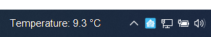
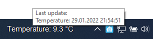
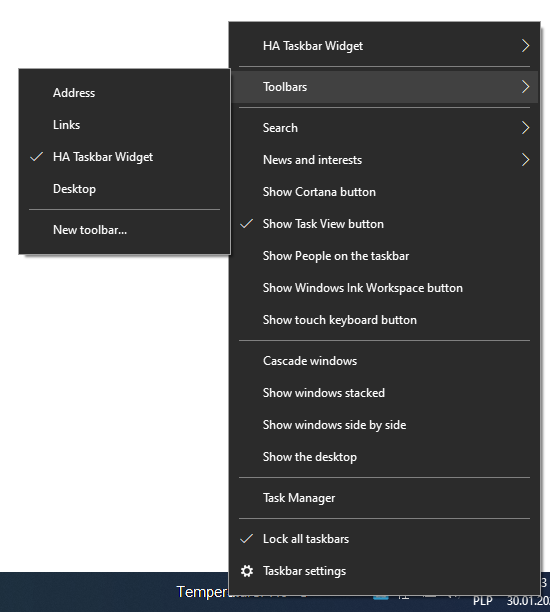
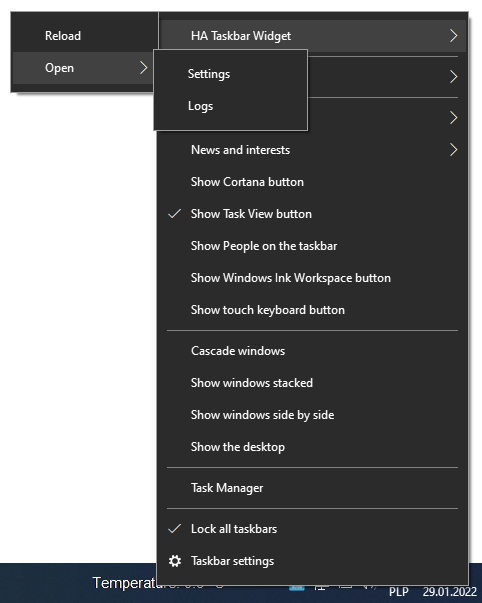

# HomeAssistant Taskbar Widget

Windows taskbar application presenting sensor data from Home Assistant.

## Screenshots

## Config
To work, the application requires a configuration file in YAML format.
This file should be named `config.yaml` and located in the `Documents\HA Taskbar Widget` directory.

Sample full path to the file: `C:\Users\Pawel\Documents\HA Taskbar Widget\config.yaml`.

A sample configuration file with description is located in [config.describe.yaml](sample/config.describe.yaml).

## Installation

Download the [latest zip](https://github.com/PawelTwardawa/HomeAssistantTaskbarWidget/releases/latest/download/HomeAssistantTaskbarWidget.zip)  file from the [release](https://github.com/PawelTwardawa/HomeAssistantTaskbarWidget/releases) section. Then unpack downloaded archive. After unpacking, run the command line with administrator privileges, then run `.\install.bat`. 

This installation script copies files to `C:\Program Files\HA Taskbar Widget` directory and registers the application.

### Uninstall

To uninstall, run the script `.\uninstall.bat` in `C:\Program Files\HA Taskbar Widget` directory.

## Logs
The application creates and saves logs to the `log.txt` file in the same directory as config file.

Sample full path to the file: `C:\Users\Pawel\Documents\HA Taskbar Widget\log.txt`.

## Debugging
To start debugging, install the application in registry using `regasm.exe`. Then, in Visual Studio, attach the debugger to `explorer.exe` process. (Debug -> Attach to process... -> Attach).

## License
[MIT License](LICENSE)

### Third-Party Licenses
 - [CS DeskBand](https://github.com/AndyJanes/CSDeskBand/blob/master/LICENSE)
